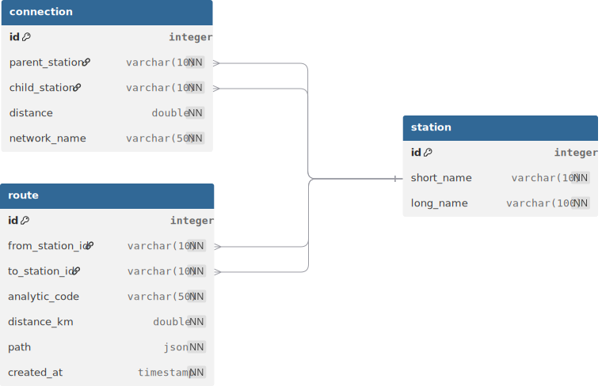

# Défi Fullstack - Système de Routage Ferroviaire

Application web pour calculer des trajets de trains entre stations et générer des statistiques agrégées par code analytique.

---

## Contexte

Ce projet est réalisé dans le cadre d'un défi technique pour le poste de Full Stack Developer chez MOB.
[Instructions de ce défi](docs/instructions/README.md)

Ce projet simule un système de gestion du trafic ferroviaire permettant de :
- Calculer la distance entre deux stations sur le réseau MOB (Montreux-Oberland-Bernois) et MVR
- Associer chaque trajet à un code analytique (fret, passager, maintenance, etc.)
- Générer des statistiques agrégées par code analytique

**Réseau couvert** : 108 stations réparties sur 2 lignes principales (MOB et MVR-ce)

---

## Architecture

### Stack Technique

#### Backend
- **PHP 8.4**
- **Symfony 7.3** : Framework pour l'API REST
- **Doctrine ORM** : Gestion de la base de données
- **PostgreSQL 16** : Base de données relationnelle

#### Frontend (à venir)
- **TypeScript 5**
- **Vue.js 3** + **Vuetify 3** : Interface utilisateur

#### Infrastructure
- **Docker Engine 25+** (testé avec Docker 29.0.1)
- **Docker Compose** : Orchestration des services
- **Nginx** : Reverse proxy

---

## Modèle de données

### Diagramme Entité-Association

